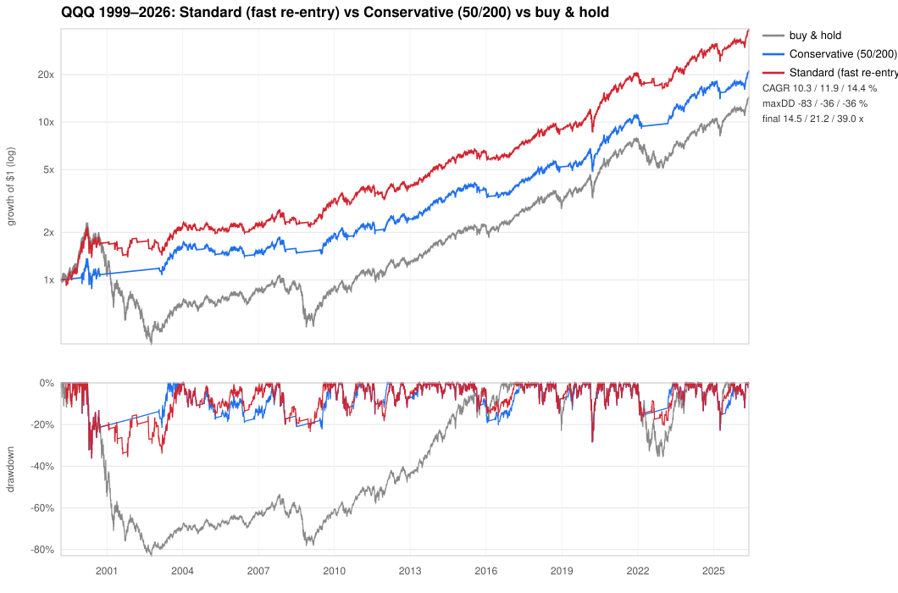

# QQQ technical-strategy study

Goal: find a **long/flat** technical strategy on daily QQQ that **beats buy-and-hold
on CAGR while taking no more downside (max drawdown) than B&H**, and verify the edge
holds across time scales from ~1 month to ~10 years.

Pure base Julia + stdlib — no packages to install.

**→ For the chosen strategy, its performance across time scales, and how to run it
as an investor, see [STRATEGY.md](STRATEGY.md).** This file documents the *study*
behind it.

## Run

```bash
julia analysis/signal.jl              # today's buy-hold/sell-wait call — the adopted blend + filter breakdown
julia analysis/build_blend_pages.jl   # per-strategy execution webpages (blend either-on / avg) → results/blend_*.html
julia analysis/blend_walkforward.jl   # OOS validation of the blends (STRATEGY.md §4c)
julia analysis/run_analysis.jl        # backtest sweep + ranking + robustness  → results/*.csv
julia analysis/walkforward.jl         # walk-forward / out-of-sample validation + hybrid check
julia analysis/cci_walkforward.jl     # CCI(50)-band walk-forward / OOS validation (see STRATEGY.md §4b)
julia analysis/cci_band_20yr.jl       # CCI(50)-band two-decade sensitivity (sell & buy threshold sweeps)
julia analysis/cross_asset_analysis.jl# do other ETFs improve QQQ timing? + generality check
julia analysis/report.jl              # per-year / per-decade / per-regime breakdown
julia analysis/plot_results.jl        # equity + drawdown chart                → results/equity_curves.svg
julia analysis/plot_hybrid.jl         # B&H vs fixed 50/200 vs fast-reentry     → results/hybrid_vs_fixed.svg
julia analysis/plot_recent.jl         # last-10-year relative performance       → results/recent_10yr.svg
julia analysis/plot_hybrid.jl SOXX    # per-ticker chart (any ticker in data/)  → results/hybrid_SOXX.svg
julia analysis/plot_universe.jl       # cross-asset risk/return scatter (2005+)  → results/risk_return.svg
julia analysis/build_report.jl        # self-contained HTML report (charts inlined) → results/QQQ_strategy.html
julia analysis/build_onepager.jl      # one-page print summary → results/QQQ_strategy_1page.html (→ PDF via Chrome)
```

One-page PDF: `julia analysis/build_onepager.jl` then
`'/Applications/Google Chrome.app/Contents/MacOS/Google Chrome' --headless=new --no-pdf-header-footer --print-to-pdf=analysis/results/QQQ_strategy_1page.pdf file://$PWD/analysis/results/QQQ_strategy_1page.html`

`build_report.jl` inlines the charts from `plot_hybrid`/`plot_recent`/`plot_results`/`plot_universe`,
so run those first. `signal.jl` and `plot_hybrid.jl` take an optional ticker argument
(default QQQ) — e.g. `julia analysis/signal.jl VGT`.

Charts are written as **SVG** (zero-dependency). The plot scripts also emit a PNG if
`rsvg-convert` is on `PATH`. Do **not** rasterize with macOS `qlmanage` — it crops wide
SVGs into a square and chops off the right (recent) years.

(`julia` lives at `~/.juliaup/bin/julia` on this machine — not on PATH.)

## Method

- **Data**: `../data/QQQ (…).csv`, 6,848 daily bars, 1999-03-10 → 2026-05-29. The window
  deliberately spans the dot-com crash, 2008, 2020 and 2022, so drawdown is stress-tested.
- **Causality**: every signal is lagged one day (`pos[i] = signal[i-1]`) before it earns a
  return — no look-ahead. Indicators are NaN until their look-back fills, so each strategy
  is automatically flat during warm-up.
- **Accounting**: long/flat only (100 % QQQ or 100 % cash). Cash earns **4 %/yr**; **5 bps**
  proportional cost on turnover. Both assumptions are stress-tested (see sensitivity table).
- **Bar**: CAGR > B&H **and** max drawdown no worse than B&H.
- **Robustness**: rolling windows of 21d…2520d (≈1mo…10yr), reporting how often the strategy
  beats B&H on return and on drawdown at each scale. This guards against the full-sample
  number being a fluke of one lucky regime exit.

## Headline result

The shipped strategy is a 50/200 SMA trend filter with two variants (see
[STRATEGY.md](STRATEGY.md)): the **Standard (fast re-entry)** central strategy and the
**Conservative (classic 50/200)** alternative. The 50/200 golden cross emerged from the
sweep below as the best return-per-drawdown rule that significantly beat B&H; the
walk-forward study then showed adding *fast re-entry* (re-enter when price reclaims the
50-day SMA, with a ~10-day minimum hold to avoid whipsaw) raises return at the same
drawdown — so it became the Standard variant.

| 1999–2026 | Standard (fast re-entry) | Conservative (50/200) | buy & hold |
|---|---:|---:|---:|
| CAGR | **14.4 %** | 11.9 % | 10.3 % |
| Total (×$1) | **39.0×** | 21.2× | 14.5× |
| Max drawdown | −36 % | −36 % | −83 % |
| Sharpe / Sortino / Calmar | **0.58 / 0.82 / 0.40** | 0.49 / 0.70 / 0.33 | 0.35 / 0.51 / 0.12 |
| OOS 2004+ CAGR / maxDD | 14.1 % / −29 % | 12.4 % / −29 % | 14.7 % / −54 % |
| Trades/yr | ~5 | ~1.3 | 0 |



## The honest read

1. **The reliable win is risk, not raw return.** Across rolling windows the flagship is
   shallower-than-or-equal to B&H on drawdown **66–86 %** of the time at *every* scale — a
   robust, assumption-free reduction. Drawdown is roughly halved and Calmar roughly tripled.

2. **It does *not* reliably out-return B&H window-by-window.** Its rolling *return* win-rate
   is mostly **below 50 %** (19–53 % depending on scale). The full-sample CAGR edge comes
   almost entirely from side-stepping the deep, grinding bear markets (esp. the −83 % dot-com
   crash right after the 1999 start), plus earning 4 % in cash while out — not from beating
   B&H in a typical year.

3. **The CAGR edge is assumption-sensitive; the drawdown edge is not.** At 0 % cash the CAGR
   advantage shrinks to ~+0.2 pp (10.5 % vs 10.3 %); at 4–5 % cash it's +1.5–2.0 pp. The
   −36 % vs −83 % drawdown gap holds regardless of cash rate or cost (robust to 10 bps).

## Trade-off frontier (all clear the bar — pick by what you weight)

| if you want…                  | strategy        | CAGR   | maxDD  | Calmar |
|-------------------------------|-----------------|-------:|-------:|-------:|
| max CAGR (accept deeper DD)   | regime-stay 200 | 12.2 % | −51 %  | 0.24   |
| **best balance (flagship)**   | **SMA 50/200**  | 11.9 % | −36 %  | 0.33   |
| smoothest ride (~B&H return)  | CCI(40)>0 / ADX | 10.3–10.5 % | −28 % | 0.37–0.38 |

There is no free lunch: to beat B&H on *return* per-window you must stay ~fully invested
(≈B&H, little drawdown relief); to cut drawdown hard you must sit out and give up return.
Genuinely beating B&H on return likely requires leverage (excluded here) or signals beyond
daily price/indicator technicals.

### An alternative overlay: the CCI(50) −120/−40 momentum band

A separate, momentum-based risk-reducer (sell when CCI(50) < −120, re-enter when CCI(50) > −40)
that's documented in full in **[STRATEGY.md §4b](STRATEGY.md)**. Over 2006–2026 — split into two
independent decades — it cuts max drawdown to ~−22 % (vs B&H's −36 %/−54 %) and roughly doubles
Calmar in both halves, at ~0.4–1.7 pp/yr less CAGR. Its walk-forward (`cci_walkforward.jl`)
mirrors the SMA finding: the fixed band beats adaptive re-optimization out-of-sample (Calmar
0.59 vs 0.46), evidence it isn't overfit. **Caveat:** unlike the SMA filter it handled the
2000–2002 dot-com grind poorly (full-1999 sample drawdown −66 %, Calmar 0.17), so its clean
~−22 % drawdown is a 2004-onward property — it's the smoother-ride option in the modern era,
not a better dot-com hedge.

## Files

- `STRATEGY.md` — **the deliverable**: chosen strategy, performance over time scales, execution guide
- `QQQBacktest.jl` — module entry point (`include` + `using .QQQBacktest`)
- `src/data.jl` — CSV loader for the `../data/` format; `load_ticker` merges all of a ticker's files by date (variable overlap, newest pull wins)
- `src/indicators.jl` — SMA/EMA/RSI/CCI/rolling stats, returns, drawdown
- `src/engine.jl` — causal long/flat backtester
- `src/metrics.jl` — CAGR, Sharpe, Sortino, max drawdown, Calmar, …
- `src/strategies.jl` — strategy library incl. shorter-horizon hybrids (`fast_reentry`, `regime_macd`, `dual_speed`) and the CCI(50) momentum band (`cci_band`) — add your own here
- `src/crossasset.jl` — align other ETFs to QQQ + cross-asset signal builders
- `src/evaluate.jl` — rolling multi-timescale comparison + walk-forward engine (`walk_forward`)
- `run_analysis.jl` — sweep, rank, pick flagship, write `results/`
- `walkforward.jl` — out-of-sample parameter-selection tests, chronological splits, hybrid validation
- `cci_walkforward.jl` — CCI(50)-band out-of-sample validation (band grid, stability, chronological splits)
- `cci_band_20yr.jl` / `cci_band_sweep.jl` / `cci_band_buy_sweep.jl` / `cci_band_test.jl` — CCI(50)-band sensitivity studies (STRATEGY.md §4b)
- `cross_asset_analysis.jl` — do other ETFs improve QQQ timing? + 50/200 across all 8 ETFs
- `report.jl` — per-year / per-decade / per-regime / rolling-CAGR breakdown
- `signal.jl` — the day-to-day tool: current buy-hold/sell-wait call for the adopted blend, with the trend + momentum filter breakdown
- `build_blend_pages.jl` — self-contained execution webpages for the two blends (`results/blend_either_on.html`, `results/blend_avg.html`)
- `blend_finalists_compare.jl` / `blend_walkforward.jl` — blend side-by-side battery and OOS validation (STRATEGY.md §4c)
- `plot_results.jl` / `plot_hybrid.jl` / `plot_recent.jl` — dependency-free SVG charts (PNG via `rsvg-convert`)
- `build_report.jl` — assembles the self-contained **`results/QQQ_strategy.html`** (charts inlined)
- `results/` — CSVs (`strategy_metrics`, `multiscale_flagship`, `cross_asset`, `annual_returns`,
  `period_returns`, `rolling_cagr`, `walkforward`, `walkforward_equity`, `cci_walkforward`,
  `cci_walkforward_equity`) + charts (`equity_curves`, `hybrid_vs_fixed`, `recent_10yr`) + `QQQ_strategy.html`
