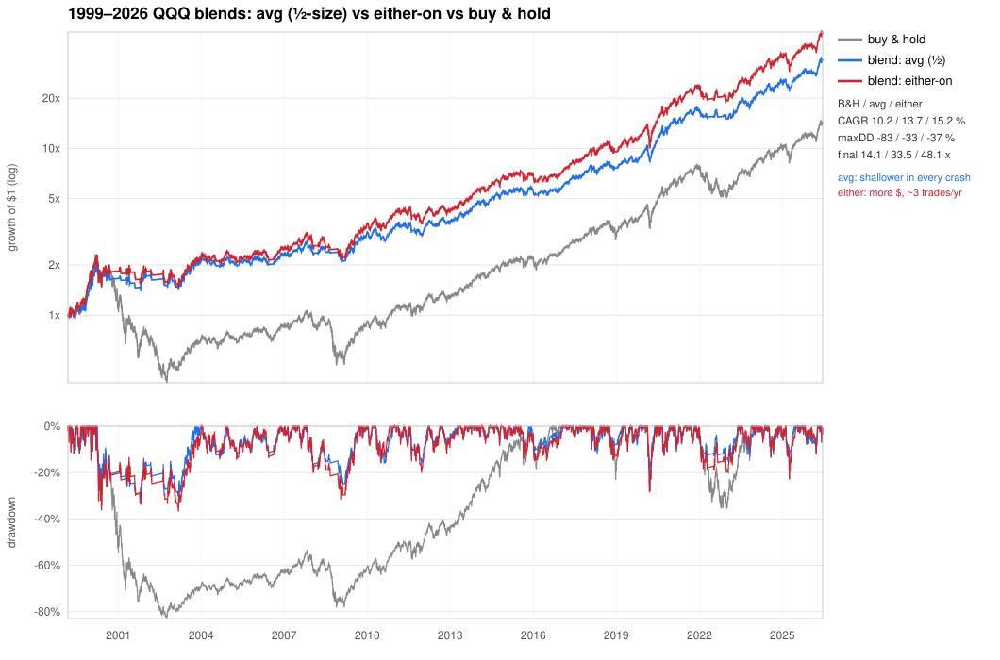

# QQQ Timing Overlay — the either-on blend

**A long/flat timing rule for QQQ that beats buy-and-hold's return over the full record
while cutting its worst drawdown by roughly half — at about three trades a year.** It
blends two filters that fail in *opposite* market regimes, so together they cover both.
Two variants:

- **either-on** *(the adopted default)* — in QQQ unless **both** filters say "out."
  Highest return, ~3 trades/yr, simple all-in/all-out.
- **avg (½-size)** — hold the *average* of the two filters (0 / 50 / 100 % invested).
  Smoothest ride, cushions every crash type, but ~12 trades/yr and fractional positions.

| (1999–2026, cash 4 %/yr, 5 bps/trade) | **either-on** | avg (½) | buy & hold |
|---|---:|---:|---:|
| CAGR | **15.3 %** | 13.7 % | 10.2 % |
| Growth of \$1 | **48×** | 34× | 14× |
| Worst drawdown | −37 % | **−33 %** | −83 % |
| Sharpe / Sortino / Calmar | 0.59 / 0.84 / 0.41 | **0.61 / 0.85 / 0.42** | 0.35 / 0.50 / 0.12 |
| Out-of-sample 2004+ CAGR / maxDD | **14.9 % / −32 %** | 13.2 % / −25 % | 14.5 % / −54 % |
| Trades per year | **~3** | ~12 | 0 |
| Worst 10-yr return | **+5 %/yr** | +5 %/yr | −8 %/yr |

*Signals are computed at the close and acted on the next session (no look-ahead); all P&L
is close-to-close. Full methodology and the strategies that lost are in [README.md](README.md).*

**Where it stands today** (run `julia analysis/signal.jl` for live status):

```
QQQ as of 2026-06-23:  close 719   SMA-50 698 > SMA-200 630   CCI(40) 27
  Trend filter (SMA 50/200 fast-reentry):    IN  since 2025-06-30
  Momentum filter (CCI(40) -100/0 + TMA):    IN  since 2026-04-08
  ► either-on:  ▲ BUY / HOLD — 100% QQQ        ► avg: 100% QQQ
```

---

## 1. What the strategy is

The blend combines a **slow trend filter** and a **fast momentum filter**, each of which
is independently a long/flat QQQ overlay (details in §2). The point of blending is that
their weaknesses are complementary:

- the **trend filter** is blind to *sudden* crashes (a 200-day average can't turn in a
  month — it sat through COVID at −29 %), but it handles long grinding bears well;
- the **momentum filter** reacts fast to crashes (−13 % in COVID) but, on its own, can be
  chopped up in a multi-year saw-toothed bear.

So one is strong exactly where the other is weak. The two blend rules:

```
either-on  (adopted default):
  • Hold QQQ whenever EITHER filter is "in."
  • Move to cash only when BOTH filters are "out"; re-enter the moment either turns "in."
  • All-in or all-out. ~3 trades/yr.

avg (½-size):
  • QQQ weight = (trend_in + momentum_in) / 2  →  0 %, 50 %, or 100 %.
  • Half-sized when the two disagree. ~12 trades/yr, fractional positions.
```

`either-on` maximizes return and minimizes effort; `avg` trades some return and turnover
for the smoothest, most consistent drawdown control. They are risk-adjusted equivalents
(Calmar 0.41 vs 0.42) — the choice is return-and-simplicity vs smoothness (see §3).

---

## 2. The two component filters

### 2a. Trend filter — SMA 50/200 with fast re-entry

Two moving averages of QQQ's daily **close** define the regime:

```
  • Hold QQQ while SMA-50 > SMA-200 (uptrend).
  • Exit to cash on a "death cross" (SMA-50 < SMA-200).
  • After an exit, re-enter as soon as price closes back above its 50-day SMA
    — don't wait for the next golden cross.
  • Keep each position ~10 trading days before switching again (anti-whipsaw).
```

It reacts to the *long* trend, lagging turns by design so it isn't faked out by wiggles.
Standalone it returns ~14.4 %/yr at −36 % drawdown over 1999–2026 — the strongest single
filter we found, and the flagship of the earlier SMA study (`analysis/sma_study/`). Its
one structural blind spot is the fast crash.

### 2b. Momentum filter — CCI(40) −100/0 with a triangular-MA switch

The Commodity Channel Index (CCI) measures how far price sits from its recent mean. This
filter is a hysteresis band on CCI(40) with a regime-dependent exit:

```
  • Enter when CCI(40) rises above 0; exit when CCI(40) falls below -100 (a deep washout).
  • BUT when the 200-day TRIANGULAR moving average is sloping down (a confirmed,
    sustained downtrend) the exit tightens to CCI(40) < 0 — i.e. it falls back to the
    reactive "CCI>0" rule that survives long grinding bears.
  • No multi-day confirmation: act on the close (confirming exits only deepens drawdown).
```

`cci_band_tma_switch` in the toolkit. It reacts to momentum extremes, so it catches fast
crashes the trend filter misses. The **triangular-MA switch is what fixes the momentum
filter's old weakness** — a plain CCI band got chopped up in the 2000–02 dot-com grind
(full-sample drawdown −66 %); gating the exit on the slow triangular-MA slope cuts that to
−32 % while leaving the modern-era behavior essentially untouched. (Lineage: this evolved
from a simpler CCI(50) −120/−40 band; the sweep/walk-forward studies are in `analysis/tests/`.)

---

## 3. Performance across time scales

The blend's edge, like its components', is **concentrated in bear markets** — but because
it diversifies two crash-response styles, its drawdown control is both deeper and more
consistent than either filter alone.



### 3a. By regime — total return over the span / deepest drawdown within it

| regime | span | buy & hold | avg (½) | either-on |
|---|---|---:|---:|---:|
| Dot-com crash | 2000–2002 | −83 % / −83 % | **−25 % / −33 %** | −29 % / −36 % |
| Global financial crisis | 2007–2009 | −53 % / −54 % | **−25 % / −25 %** | −30 % / −32 % |
| 2009–2020 bull | 2009–2020 | **+820 %** / −23 % | +397 % / −16 % | +537 % / −20 % |
| COVID crash | Feb–Mar 2020 | −28 % / −29 % | **−20 % / −21 %** | −28 % / −29 % |
| 2022 bear | 2021–2022 | −36 % / −36 % | **−14 % / −14 %** | −20 % / −20 % |
| 2023–2026 recovery | 2022–2026 | +184 % / −23 % | +128 % / −15 % | +156 % / −23 % |

This is the structural fork between the two variants. **`avg` cushions every crash type,
including fast ones** (COVID −21 %, 2022 −14 %), because whenever one filter is caught off
guard the other has usually exited, so you're only half-exposed. **`either-on` keeps the
trend filter's fast-crash blind spot** (COVID −29 %, same as buy-and-hold) — the price it
pays for staying fully invested and out-returning everything else.

### 3b. Return consistency by holding period — annualized: worst / median / best

| horizon | buy & hold | avg (½) | either-on |
|---|---:|---:|---:|
| 1 year | −65 / +16 / +118 | −17 / +12 / +96 | −19 / +13 / +118 |
| 3 years | −39 / +13 / +34 | −8 / +12 / +31 | −10 / +13 / +34 |
| 5 years | −20 / +14 / +28 | −0 / +12 / +26 | −1 / +13 / +28 |
| 10 years | −8 / +12 / +21 | **+5** / +11 / +20 | **+5** / +13 / +22 |

Read the **worst** column: buy-and-hold has had losing 1-, 3-, 5- and 10-year stretches;
neither blend has had a losing 5- or 10-year window in 27 years, and `either-on`'s medians
match or beat buy-and-hold's. You eliminate the catastrophic tail without surrendering the
middle.

### 3c. Win-rate vs buy & hold (rolling windows: return-beat % / shallower-drawdown %)

| | 1 mo | 1 yr | 5 yr |
|---|---:|---:|---:|
| avg (½) | 39 / 82 | 31 / **90** | 54 / **99** |
| either-on | 36 / 72 | 38 / 73 | **59** / 87 |

The dependable edge is **drawdown**: `avg` is shallower than buy-and-hold in ~99 % of
rolling 3–5-year windows. On raw return both mostly trail buy-and-hold in short windows
(the full-sample CAGR edge comes from side-stepping deep bears plus earning cash yield
while out), but `either-on` pulls ahead on return at longer horizons (59 % of 5-yr windows).

---

## 4. Robustness: walk-forward & out-of-sample

The blends have **no free parameters** — each is a fixed combination of two filters whose
own parameters were already walk-forward validated (the round numbers beat adaptive
re-optimization, both for the SMA filter and the CCI band; see `analysis/sma_study/` and
`analysis/tests/`). So the question for the blend is whether *committing* to it does as well
out-of-sample as adaptively re-choosing among the building blocks each year.

| OOS 2004–2026 | CAGR | maxDD | Calmar |
|---|---:|---:|---:|
| buy & hold | 14.5 % | −54 % | 0.27 |
| **either-on (fixed)** | **14.9 %** | −32 % | 0.47 |
| avg (fixed) | 13.2 % | **−25 %** | **0.53** |
| adaptive walk-forward (re-picks yearly) | 13.1 % | −29 % | 0.46 |

`analysis/blend_walkforward.jl`. Two findings, both of which **strengthen** confidence:

1. **Committing to a fixed blend beats adaptively re-selecting** among {B&H, trend, momentum,
   avg, either-on} each year (Calmar 0.47 / 0.53 vs 0.46) — and the adaptive selector *only
   ever picks a blend*, never a standalone. The combination isn't overfit.
2. **Out-of-sample (dot-com in training), `either-on` still edges buy-and-hold on return**
   (14.9 % vs 14.5 %) at ~half the drawdown — a far better risk-adjusted ride.

---

## 5. Why QQQ specifically

We ran the underlying 50/200 filter on all eight ETFs in the dataset. The drawdown
protection is **universal**; the return boost is **not** — it only *added* return on
high-momentum, deep-crash assets (QQQ, energy, long bonds) and *hurt* choppier indices like
small-caps (IWM −4.5 pp/yr) and the Dow (DIA −2.7 pp). QQQ is the standout equity beneficiary
precisely because it trends hard and crashes hard — exactly what these filters exploit. Using
*other* ETFs to confirm QQQ timing only reduced return; QQQ's own price already encodes the
regime. (`analysis/sma_study/cross_asset_analysis.jl`.)

---

## 6. How to execute

### Inputs & routine
You need QQQ's daily **OHLC** (the CCI uses high/low/close; everything else uses the close).
After the close, update the two filters — or just run `julia analysis/signal.jl`, which
prints the call and the breakdown — and apply your chosen blend rule:

- **either-on:** be in QQQ unless *both* filters are out. Move to cash only when the trend
  filter is in a death cross **and** the momentum filter has exited; re-enter when either
  flips back in. Exits are rare (~3/yr) — checking a few times a week is plenty.
- **avg:** set your QQQ weight to 0 / 50 / 100 % per how many filters are in. Changes
  cluster around turns (~12/yr); check daily in volatile periods.

Execute changes at the next session.

### Where to hold each state
- **Long:** QQQ, or **QQQM** (same index, lower 0.15 % fee). **Do not** use leveraged ETFs
  (TQQQ) — leverage amplifies whipsaw and breaks the risk profile.
- **Cash:** a money-market fund, T-bills, or HYSA earning ~4 % — *not* idle 0 % cash; part of
  the return edge depends on earning yield while out (the drawdown protection does not).

### Account & tax
`either-on` realizes ~3 taxable events/year — quite tax-friendly. `avg` realizes ~12 plus
fractional rebalances — **strongly prefer a tax-advantaged account** (IRA / Roth / 401k) for
it. If you must run in a taxable account, `either-on` is the cleaner choice.

### Discipline & when it disappoints
Follow the rule **mechanically**; the hard moments are selling while the market still feels
fine and re-buying while it still feels scary. Expect to **trail buy-and-hold in sustained
bulls** (the 2010s) until the next deep bear, which is when the overlay earns its keep. And
know the variants' blind spots: **`either-on` will ride a fast crash down** (COVID −29 %) —
if a sudden plunge is your main fear, use `avg`, which cushions it (−21 %).

The per-strategy webpages — `results/blend_either_on.html` and `results/blend_avg.html`
(built by `analysis/build_blend_pages.jl`) — carry the full assessment and a live signal card.

---

## 7. Reproduce / monitor

```bash
export PATH="$HOME/.juliaup/bin:$PATH"          # julia lives in ~/.juliaup/bin
# ── production: the adopted blend (analysis/ root) ──
julia analysis/signal.jl                        # today's buy-hold/sell-wait call + filter breakdown
julia analysis/fetch_data.jl                    # refresh data/ from a free source (last 10 trading days)
julia analysis/blend_finalists_compare.jl       # the full side-by-side battery (either-on vs avg vs B&H)
julia analysis/blend_walkforward.jl             # §4 out-of-sample validation
julia analysis/build_blend_pages.jl             # the per-strategy execution webpages
julia analysis/plot_blend_finalists.jl          # the §3 equity + drawdown chart
# ── component studies ──
julia analysis/sma_study/run_analysis.jl        # the SMA trend-filter study (sweep / rank / walk-forward)
julia analysis/tests/cci_tma_robustness.jl      # the momentum filter's lb / TMA-period sensitivity
julia analysis/tests/cci_tma_walkforward.jl     # the momentum filter's out-of-sample test
```

---

*This is a historical backtest of mechanical rules on one index — not investment advice or
a prediction. Past performance does not guarantee future results; QQQ's defining feature,
concentration in a handful of large-cap tech names, cuts both ways. The story is dominated by
the 2000s, and results depend on the cost/cash assumptions above.*
