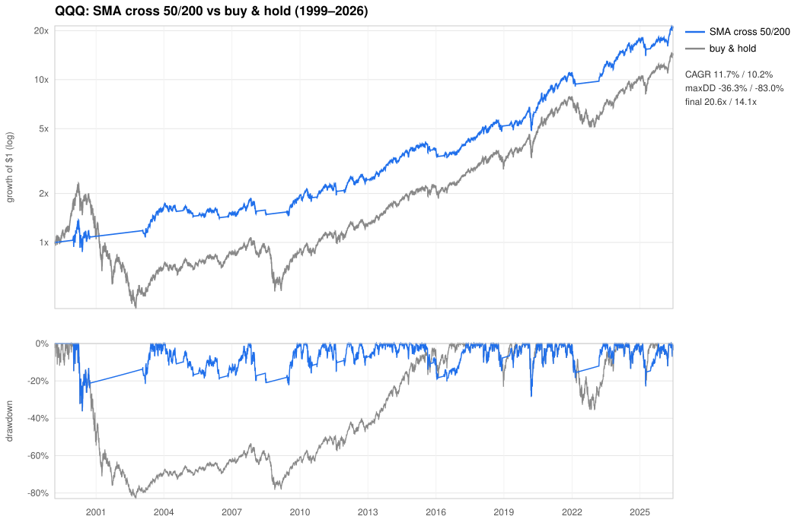
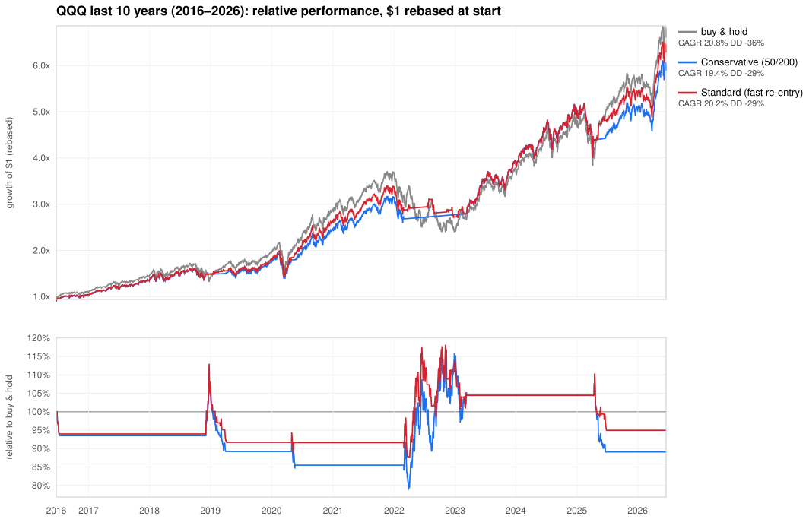

# QQQ Trend-Filter Strategy

**A long/flat timing rule for QQQ that captures most of buy-and-hold's return while
cutting its worst drawdown by more than half.** It comes in two variants:

- **Standard (fast re-entry)** — the central strategy. Steps aside in downtrends but
  re-enters quickly once price recovers, capturing more upside.
- **Conservative (classic 50/200)** — simpler and lower-maintenance: the same crash
  protection, but it waits for a full trend reversal to re-enter, trading ~1×/yr.

| (1999–2026, cash 4%/yr, 5 bps/trade) | **Standard** | Conservative | buy & hold |
|---|---:|---:|---:|
| CAGR | **14.4 %** | 11.9 % | 10.3 % |
| Growth of \$1 | **39.0×** | 21.2× | 14.5× |
| Worst drawdown | **−36 %** | −36 % | −83 % |
| Sharpe / Sortino / Calmar | **0.58 / 0.82 / 0.40** | 0.49 / 0.70 / 0.33 | 0.35 / 0.51 / 0.12 |
| Out-of-sample CAGR (2004+) | **14.1 %** | 12.4 % | 14.7 % |
| Out-of-sample drawdown | −29 % | −29 % | −54 % |
| Trades per year | ~5 | ~1.3 | 0 |
| Worst 10-yr return | **+5 %/yr** | +4 %/yr | −8 %/yr |

*Signals are computed at the close and acted on the next session (no look-ahead). Full
methodology and the strategies that lost are in [README.md](README.md).*

---

## 1. What the strategy is

Two moving averages of QQQ's daily **closing** price — the 50-day (≈10 weeks) and the
200-day (≈10 months) — define the trend regime:

```
Standard (fast re-entry):
  • Hold 100% QQQ while SMA-50 > SMA-200 (uptrend).
  • Exit to cash when SMA-50 < SMA-200 (a "death cross").
  • After an exit, re-enter as soon as QQQ closes back above its 50-day SMA
    — do NOT wait for the next golden cross.
  • Keep each position at least ~10 trading days (≈2 weeks) before switching
    again, to avoid whipsaw.

Conservative (classic 50/200):
  • Hold QQQ while SMA-50 > SMA-200; hold cash otherwise.
  • (Re-enter only on the golden cross — simpler, slower, fewer trades.)
```

Both are **trend filters**: they stay invested while the trend is up and step aside
when the long trend rolls over. They don't predict — they react, lagging turns by
design so they aren't faked out by every wiggle. The only difference is *how fast they
get back in* after stepping aside. The Standard variant's faster re-entry is what lets
it recover most of the return a pure 50/200 filter gives up.

**Where it stands today** (run `julia analysis/signal.jl` for live status):

```
QQQ as of 2026-05-29:  close 738.31   SMA-50 652.93 > SMA-200 617.85
Standard:     ▲ LONG  (re-entered 2025-06-30)
Conservative: ▲ LONG  (golden cross 2025-06-24)
```

---

## 2. Performance across time scales

The most important fact about both variants: **their return edge is concentrated in
bear markets, and they lag in sustained bulls.** They are best understood as downside
insurance that, on QQQ, has historically paid for itself.


### 2a. By decade — annualized return / max drawdown

| decade | buy & hold | Standard | Conservative |
|---|---:|---:|---:|
| 2000s | **−7.0 %** / −83 % | **+6.4 %** / −36 % | +5.8 % / −36 % |
| 2010s | **+16.5 %** / −23 % | +12.7 % / −18 % | +12.0 % / −20 % |
| 2020s | +21.1 % / −36 % | **+21.8 %** / −29 % | +21.1 % / −29 % |

The full-period edge comes from the **2000s "lost decade"**, when buy-and-hold *lost*
money over ten years and the filter made money. In the relentless 2010s bull,
buy-and-hold **won** on return. In the 2020s the Standard variant edges out
buy-and-hold with less risk.

### 2b. By market regime — total return over the span / deepest drawdown within it

| regime | span | buy & hold | Standard | Conservative |
|---|---|---:|---:|---:|
| Dot-com crash | 2000–2002 | −83 % / −83 % | −25 % / −36 % | **−12 % / −36 %** |
| Mid-2000s recovery | 2002–2007 | +166 % / −17 % | +72 % / −21 % | +56 % / −19 % |
| Global financial crisis | 2007–2009 | −52 % / −54 % | −17 % / −24 % | **−16 % / −21 %** |
| 2009–2020 bull | 2009–2020 | **+821 %** / −23 % | +434 % / −18 % | +346 % / −20 % |
| COVID crash | Feb–Mar 2020 | −28 % / −29 % | −28 % / −29 % | −28 % / −29 % |
| Post-COVID surge | 2020–2021 | +137 % / −13 % | +137 % / −13 % | +127 % / −13 % |
| 2022 bear | 2021–2022 | −36 % / −36 % | −20 % / −20 % | **−13 % / −18 %** |
| 2023–2026 recovery | 2022–2026 | +184 % / −23 % | +137 % / −23 % | +118 % / −23 % |

Both shine in **every grinding bear** vs buy-and-hold. Note the Standard/Conservative
trade-off: the Standard variant captures **more of the bull runs** (2009–2020: +434 %
vs +346 %) but gives up a little crash protection in individual bears (dot-com −25 % vs
−12 %; 2022 −20 % vs −13 %) because its faster re-entry occasionally catches a brief
relief rally before the decline resumes. Their *worst-case* drawdown over the whole
history is identical (−36 %). Neither dodges the **COVID crash** — a one-month plunge is
too fast for a 200-day average to react.

### 2c. Return consistency by holding period — annualized: worst / median / best

| horizon | buy & hold | Standard | Conservative |
|---|---:|---:|---:|
| 1 year | −65 / **+16** / +118 | −18 / +11 / +105 | −18 / +10 / +79 |
| 3 years | −39 / +13 / +34 | −9 / +13 / +32 | **−4** / +12 / +29 |
| 5 years | −20 / +14 / +28 | **−0 / +13 / +27** | −2 / +11 / +27 |
| 10 years | −8 / +12 / +21 | **+5 / +12 / +21** | +4 / +11 / +20 |

Read the **worst** column: buy-and-hold has had losing 1-, 3-, 5- and 10-year stretches.
The Standard variant **never had a losing 5- or 10-year window** in 27 years (worst
10-yr +5 %/yr) and its medians are close to buy-and-hold's — you give up a little median
upside to eliminate the catastrophic tail.

### 2d. Short-horizon win-rate vs buy & hold (rolling windows: return % / drawdown %)

| | 1 mo | 3 mo | 6 mo | 1 yr |
|---|---:|---:|---:|---:|
| **Standard** | **39**/75 | **42**/77 | **41**/74 | **37**/77 |
| Conservative | 37/79 | 37/80 | 36/78 | 33/71 |

The Standard variant's faster re-entry lifts its short-horizon return-win-rate above the
Conservative rule's at every scale. Both still lose to buy-and-hold on raw return in
most short windows — their dependable edge is drawdown reduction (shallower 74–80 % of
the time), not beating B&H in a typical quarter.

---

## 3. Robustness: walk-forward & out-of-sample

The full-sample numbers were chosen with hindsight, so we re-ran the study the way you'd
actually trade it: a 22-strategy grid re-evaluated every year on a training window, the
best traded the **next** year, OOS segments stitched together. The first OOS year is
**2004**, so the dot-com crash — the filter's signature win — lands in *training*. A
deliberately hard test. (`analysis/walkforward.jl`.)

| OOS 2004–2026 | CAGR | maxDD | Calmar |
|---|---:|---:|---:|
| buy & hold | **14.7 %** | −54 % | 0.27 |
| **Standard (fast re-entry)** | 14.1 % | **−29 %** | **0.49** |
| Conservative (50/200) | 12.4 % | −29 % | 0.43 |
| walk-forward (anchored) | 6.1 % | −16 % | 0.38 |
| walk-forward (rolling 5y) | 8.1 % | −32 % | 0.25 |

Three findings, all of which **strengthen** confidence the rule isn't overfit:

1. **Out-of-sample the Standard variant nearly matches buy-and-hold's return (14.1 % vs
   14.7 %) at roughly half the drawdown (−29 % vs −54 %)** — a far better risk-adjusted
   ride. The Conservative variant trails on return but is equally smooth.
2. **Adaptively re-optimizing the parameters does *worse* than a fixed rule.** If clever
   in-sample tuning can't beat a round, fixed choice, the fixed choice isn't overfit —
   trend-following works broadly and the exact lengths barely matter.
3. **Chronological splits agree** — in-sample-"optimal" parameters generalize no better
   than the round numbers.

The Standard variant's parameters (50/200, re-enter above the 50-day, ~10-day hold) are
robust: out-of-sample results barely move for re-entry lengths of 40–50 days and holds of
5–21 days. (The deep-crash drawdown in the *full* sample is a touch more parameter-sensitive
around the dot-com era — another reason the Conservative variant exists.)

---

## 4. The conservative variant — when to prefer it

The classic 50/200 golden-cross filter is the Standard variant without the fast
re-entry: it returns to QQQ only when SMA-50 climbs back above SMA-200. That makes it:

- **Simpler and lower-maintenance** — ~1.3 trades/year vs ~5, and an unambiguous rule.
- **Tighter on individual-bear protection** — −12 % through the dot-com crash and −13 %
  in 2022 (vs the Standard variant's −25 % and −20 %), because it never re-enters into a
  relief rally.
- **Lower-returning** — 11.9 % vs 14.4 % CAGR; it gives up more of each recovery.

Prefer it if you value the fewest possible trades, the cleanest rule, and the tightest
drawdown control in a crash, and you're willing to leave some return on the table. The
full-history equity/drawdown of the conservative rule vs buy-and-hold:



### Last 10 years — relative performance



The bottom panel shows each variant *relative to buy & hold* (above 100 % = cumulatively
ahead). Both drift below in calm bull runs, then jump above during every selloff
(late-2018, 2022, the 2025 dip); the Standard variant (red) stays ahead of the
Conservative (blue) by getting back in sooner. Over the last decade the Standard variant
slightly **beat** buy-and-hold on return with a shallower drawdown.

---

## 4b. An alternative overlay — the CCI(50) −120/−40 momentum band

A separate, **momentum-based** overlay that reduces drawdown without the moving-average
machinery. It uses the 50-day Commodity Channel Index (CCI), a normalized measure of how
far price sits from its recent mean:

```
CCI(50) band (hysteresis):
  • Start invested. Sell to cash when CCI(50) falls below −120 (a deep washout).
  • Stay in cash until CCI(50) climbs back above −40, then re-enter.
  • The wide −120 / −40 band keeps it from re-entering into continued weakness.
```

It's a pure **risk-reducer**, not a return-booster, and it earns its keep the same way the
SMA filter does — by side-stepping deep, grinding selloffs while earning cash yield out.
Tested over 20 years split into two independent decades:

| (QQQ, cash 4 %/yr, 5 bps/trade) | Prior decade ’06–’16 | Recent decade ’16–’26 | Full 20 yr |
|---|---:|---:|---:|
| CCI band CAGR / B&H CAGR | 10.7 % / 11.0 % | 19.2 % / 20.9 % | 14.9 % / 15.9 % |
| **CCI band maxDD / B&H maxDD** | **−21 % / −54 %** | **−23 % / −36 %** | **−23 % / −54 %** |
| CCI band Calmar / B&H Calmar | **0.50 / 0.21** | **0.85 / 0.59** | **0.65 / 0.30** |
| Trades/yr | ~5 | ~5 | ~5 |

The trade-off is identical in both halves: give up ~0.4–1.7 pp/yr of CAGR for **roughly half
the drawdown and ~double the Calmar**. The drawdown control is strikingly stable — ~−22 % in
every window regardless of regime.

**Parameter robustness.** The two thresholds were swept independently. The **−40 re-entry was
the CAGR peak even in the independent prior decade** (not just in the recent one it was first
found on) — eager re-entry (buy < −60) whipsaws *and* deepens drawdown to ~−42 %; over-patient
re-entry (buy > +40) bleeds return. The **−120 exit sits in a flat plateau** (−110 to −140 all
behave similarly); the exit level is a low-leverage knob, the re-entry level is the one that
matters. See `analysis/cci_band_sweep.jl` (sell), `cci_band_buy_sweep.jl` (buy), and
`cci_band_20yr.jl` (two-decade sensitivity).

**Walk-forward (out-of-sample).** Re-selecting the band every year from a 25-band grid using
*only past data* (first OOS year 2004, so the dot-com crash is in training) does **worse** than
the fixed −120/−40: over OOS 2004–2026 the fixed rule returns **13.5 %/yr at −23 % drawdown
(Calmar 0.59)** while the adaptive walk-forward manages 12.2 % at −27 % (Calmar 0.46), and B&H
14.6 % at −54 %. The walk-forward consistently lands on −110/0 — one grid-step from −120/−40 —
and in chronological train/test splits the fixed −120/−40 generalizes forward *better* than the
in-sample-optimal band. As with the SMA filter, the fact that clever re-optimization can't beat
the round fixed choice is evidence the choice isn't overfit. (`analysis/cci_walkforward.jl`.)

**The one blemish — the dot-com crash.** Over the *full* 1999–2026 sample its worst drawdown is
**−66 %, not −22 %**. In the 2000–2002 grind, CCI's mean-reversion re-entries kept buying relief
rallies before the next leg down, so it never fully stepped aside (full-sample Calmar 0.17, vs
the SMA filter's 0.33). The clean ~−22 % drawdown is a **2004-onward property** — over its OOS
life it's excellent, but it has not been stress-tested kindly by a prolonged saw-toothed bear.
If dodging *that* kind of market is the priority, the SMA Conservative variant is the safer tool.

**Where it stands today** (run `julia analysis/signal.jl`):

```
QQQ as of 2026-05-29:  close 738.31   CCI-50 123.70
CCI(50) band -120/-40:  ▲ LONG  (re-entered 2026-04-08, after the early-2026 dip)
```

**SMA filter vs CCI band — which to use.** They're complementary, not competing:

- The **SMA trend filter** (Standard/Conservative) reacts to the *long* trend; it's slower,
  trades less, and over the full 1999–2026 sample out-returns B&H.
- The **CCI band** reacts to *momentum extremes*; it cuts drawdown a touch harder and more
  consistently across regimes, at slightly lower raw return. It does not out-return B&H over
  rolling 20-yr windows — it's the smoother-ride option.

Honest caveat: annualized it preserves ~93–96 % of B&H CAGR, but **compounded** that is ~76 %
of terminal wealth over 10 yr and ~84 % over 20 yr — the cash drag and slightly-late re-entries
cost real money over long holds. Choose it when a livable −22 % worst case (vs −54 %) matters
more than the last point of return.

## 4c. The adopted overlay — blending the trend and momentum filters

The SMA fast-reentry filter and the CCI(40) momentum filter fail in *opposite* regimes
(SMA is blind to fast crashes; CCI is weak in long grinding bears), so blending them
diversifies the drawdowns. Two blends are the production candidates, both built from the
same pair (`blend_components`):

- **either-on** (`blend_either_on`) — long if EITHER filter is long. Highest return
  (≈15% CAGR, 49× since 1999), **~3 trades/yr**, simple all-in/all-out. Keeps the SMA's
  fast-crash blind spot (−29% in COVID). The low-effort, max-return pick.
- **avg ½-size** (`blend_avg`) — exposure = (CCI + FR)/2 ∈ {0, ½, 1}. Smoothest ride,
  cushions *every* crash type (−21% COVID), shallower than B&H in ~99% of rolling 3–5yr
  windows. Costs ~12 trades/yr and fractional positions.

**Validated OOS** (`analysis/blend_walkforward.jl`): committing to a fixed blend beats
adaptively re-selecting among {B&H, CCI, FR, avg, either-on} each year (either-on Calmar
0.47, avg 0.53 vs adaptive 0.46) — and the adaptive selector *only ever picks a blend*,
never a standalone. Out-of-sample 2004+, either-on edges B&H on return (14.9% vs 14.5%) at
~half the drawdown.

**Live signal & execution guides:** `julia analysis/signal.jl` prints the current
buy-hold / sell-wait call with the two-filter breakdown; the per-strategy webpages
(`results/blend_either_on.html`, `results/blend_avg.html`, built by
`analysis/build_blend_pages.jl`) carry the full assessment and how-to-execute. Side-by-side
study: `analysis/blend_finalists_compare.jl` + chart `results/blend_finalists.svg`.

## 5. Why QQQ specifically

We ran the same 50/200 filter on all eight ETFs in the dataset. The drawdown protection
is **universal**; the return boost is **not** — it only *added* return on high-momentum,
deep-crash assets (QQQ, energy, long bonds) and *hurt* choppier indices like small-caps
(IWM −4.5 pp/yr) and the Dow (DIA −2.7 pp). QQQ is the standout equity beneficiary
precisely because it trends hard and crashes hard, which is exactly what a trend filter
exploits.

We also tested using the other ETFs to **inform** QQQ timing (broad-market confirmation
from SPY/DIA, small-cap breadth from IWM, risk-on/off vs bonds). All of them *reduced*
return by adding conservatism — QQQ's own trend already encodes the regime. Don't
over-engineer it. (`analysis/cross_asset_analysis.jl`.)

---

## 6. How to execute (Standard variant)

### Inputs & routine
You need only QQQ's **daily closing price**. After the close, update the 50- and 200-day
moving averages (or run `julia analysis/signal.jl`) and apply the rule:

- **In cash and QQQ closes above its 50-day SMA →** buy QQQ (re-enter).
- **Long and SMA-50 drops below SMA-200 (death cross) →** sell QQQ, move to cash.
- After any switch, **wait ~10 trading days** before switching again.

Execute changes at the next session's open. The Standard variant averages ~5 trades/year
but **clusters in choppy markets** (e.g. several round-trips in 2016 and 2022) and goes
quiet for years in clean trends — checking daily (or every couple of days in volatile
periods) is enough.

### Where to hold each state
- **Long:** QQQ, or **QQQM** (same index, lower 0.15 % expense ratio).
- **Cash:** a money-market fund, T-bills, or HYSA — **not** idle 0 % cash; the return
  edge partly depends on earning ~4 % here (the drawdown protection does not). **Do not**
  use leveraged ETFs (TQQQ): leverage amplifies whipsaw and breaks the risk profile.

### Account & tax
The Standard variant realizes ~5 taxable events/year, the Conservative ~1. **Use a
tax-advantaged account** (IRA / Roth / 401k) so switches don't trigger capital-gains tax —
this matters more for the Standard variant. In a taxable account, the Conservative variant's
lower turnover is the safer choice.

### Discipline — the hard part
Follow the rule **mechanically**. The two difficult moments: **selling after a death
cross** when the market still feels fine, and **re-buying** when sentiment is still fearful
and price has already bounced. The Standard variant's faster re-entry means you'll
occasionally buy back in just before a second leg down — accept the rule's small whipsaws;
they're the price of catching real recoveries early.

### When it will disappoint you
- **Sudden crashes** (COVID-style): a 200-day average can't react in days.
- **Choppy, sideways markets** (2015–16): expect a cluster of whipsaw trades.
- **Sustained bull markets** (the 2010s): you'll trail buy-and-hold until the next deep
  bear, which is when the strategy earns its keep.

---

## 7. Reproduce / monitor

```bash
export PATH="$HOME/.juliaup/bin:$PATH"      # julia lives in ~/.juliaup/bin
julia analysis/signal.jl                    # today's buy-hold/sell-wait call (the blend + breakdown)
julia analysis/build_blend_pages.jl         # §4c per-strategy webpages (either-on / avg)
julia analysis/blend_finalists_compare.jl   # §4c side-by-side battery (either-on vs avg)
julia analysis/blend_walkforward.jl         # §4c blend OOS validation
julia analysis/run_analysis.jl              # full strategy sweep + ranking + robustness
julia analysis/walkforward.jl               # §3 walk-forward / OOS tests (SMA grid)
julia analysis/cci_walkforward.jl           # §4b walk-forward / OOS tests (CCI band grid)
julia analysis/cci_band_20yr.jl             # §4b two-decade sensitivity (sell & buy sweeps)
julia analysis/report.jl                    # per-year / per-decade / per-regime tables
julia analysis/cross_asset_analysis.jl      # §5 cross-asset study
julia analysis/plot_hybrid.jl               # the §2 three-way chart
julia analysis/plot_recent.jl              # the §4 last-10-year relative-performance chart
julia analysis/build_report.jl              # the standalone HTML version of this document
```

---

*This is a historical backtest of mechanical rules on one index — not investment advice
or a prediction. Past performance does not guarantee future results; QQQ's defining
feature, concentration in a handful of large-cap tech names, cuts both ways. The story is
dominated by the 2000s, and results depend on the cost/cash assumptions above.*
